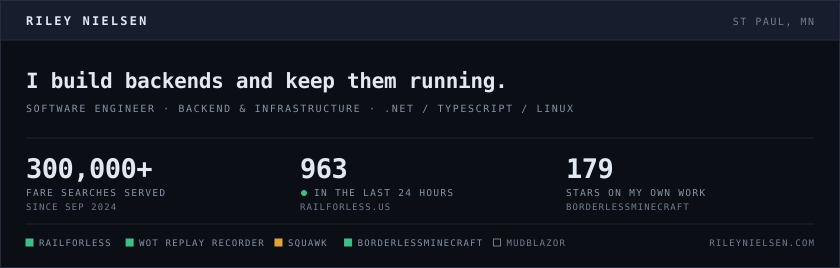

<picture>
  <source media="(prefers-color-scheme: dark)" srcset="./assets/card-dark.svg">
  <source media="(prefers-color-scheme: light)" srcset="./assets/card-light.svg">
  
</picture>

### What I'm running

| | | |
|---|---|---|
| **[RailForLess](https://railforless.us)** | Fare comparison for Amtrak travel. Co-founded 2022, launched 2023. I own the backend: API, database, and the scraper that pulls fare data. | `TypeScript` `Workers` `Hono` `Drizzle` |
| **[WoT Replay Recorder](https://wotreplayrecorder.com)** | Upload a `.wotreplay` file; it boots the game, plays the replay, records it with OBS, and hands back the MP4. | `Containers` `OBS` |
| **Squawk** *(in development)* | iOS app that reads an aircraft's live position feed from the in-flight entertainment box over cabin Wi-Fi and puts the flight on a map, with a lock-screen Live Activity. Entirely offline. | `Swift` `SwiftUI` `Live Activities` |
| **[BorderlessMinecraft](https://github.com/iamtechnyx/BorderlessMinecraft)** | Runs Minecraft as a borderless window so alt-tab doesn't minimize or pause the game. | `C#` `GPL-3.0` |
| **[MudBlazor](https://github.com/MudBlazor/MudBlazor)** | Contributor since 2022. Reviewed PRs, fixed bugs, and built `MudFileUpload`, which shipped as part of the library. | `C#` `Blazor` |

### Background

Seven years of full-stack work, two of them full-time. At SRF Consulting Group I owned
~25 applications end to end — single-user tools through platforms used across 400
employees — and built a Linux deployment pipeline from scratch to replace a legacy
Windows release process.

Mostly .NET and TypeScript, and the Linux infrastructure underneath.

---

[rileynielsen.com](https://rileynielsen.com) · [résumé](https://rileynielsen.com/resume) · riley@nielsen.tech

The header card regenerates daily from the RailForLess and GitHub APIs — see <a href="./.github/workflows/refresh-card.yml">the workflow</a>.
